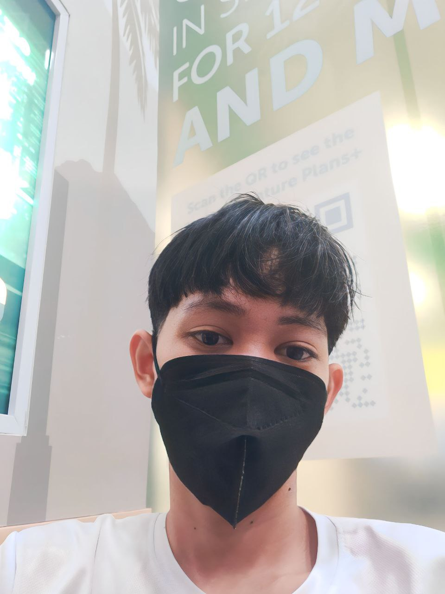

# Cozy Cafe
## Project Description 
This project aims to be a training ground for computer science students in web designing using their preferred language
and practicing Virtual Control System with our fellow classmates as collaborator.
# Features
-To promote our new established project business named cozy cup coffee
-To established connections with inspiring stories through a cup of coffee in cozy cup coffee
#  Screen captures 

This shows the interior of the cafe.

This shows the different kind of pastries and drinks. 

This shows the information of the owners. 

This shows the contact information of the cafe. 

<strong>Brian Keinth Arnejo</strong>

Email: <a href="mailto:arnejobrian@gmail.com">arnejobrian@gmail.com</a>

<strong>Aneza Jamion</strong>

Email: <a href="mailto:anezajamion@gmail.com">anezajamion@gmail.com</a>

## Socials

<a href="https://www.facebook.com/synn.kb" style="display: inline-flex; align-items: center; text-decoration: none; margin-right: 20px;">
    
    Keinth Arnejo
</a>

<a href="https://www.facebook.com/profile.php?id=100070879459309&mibextid=ZbWKwL" style="display: inline-flex; align-items: center; text-decoration: none;">
    
    Aneza Jamion
</a>

<a href="https://github.com/ArnejoKeinth" style="display: inline-flex; align-items: center; text-decoration: none; margin-right: 20px;">
    
    ArnejoKeinth
</a>

<a href="https://github.com/zha7nea" style="display: inline-flex; align-items: center; text-decoration: none;">
    
    zha7nea
</a>

